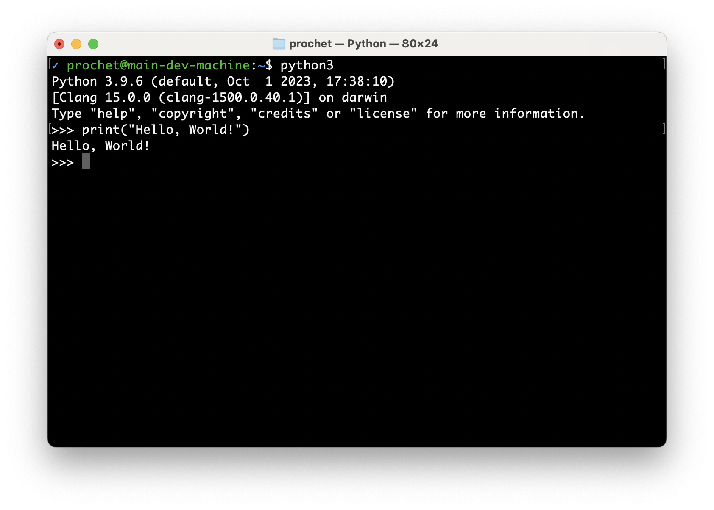
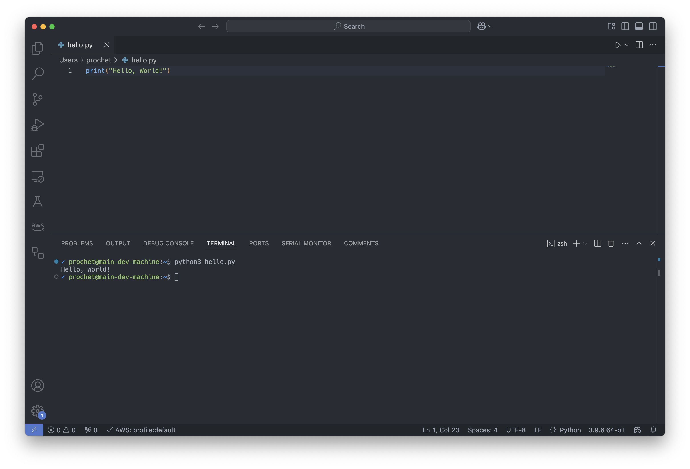

import { Aside, Steps, Code } from "@astrojs/starlight/components"

## Hello World

Le "Hello, World!" est une expression courante utilisée dans le domaine de la programmation informatique pour désigner le premier programme qu'on apprend à écrire dans un nouveau langage.
L'objectif principal est de tester l'environnement de développement et de démontrer les bases du langage de manière simple. En général, ce programme affiche simplement le texte "Hello, World!" à l'écran.

### Avec l'interpréteur Python

Voici comment écrire un programme "Hello, World!" en Python en utilisant l'interpréteur Python:

<Steps>
  <ol>
    <li>Commencer par ouvrir un terminal.</li>
    <li>
      Démarrer l'interpréteur Python en tapant la commande `python` or
      `python3`.
    </li>
    <li>
      Ecrire le code suivant dans l'interpréteur:
      <Code code={`print("Hello, World!")`} lang="py" />
    </li>
  </ol>
</Steps>

Vous devriez voir le texte "Hello, World!" s'afficher à l'écran comme dans la capture ci-dessous:

Voyons un peu plus en détail ce que vous venez de faire:

Vous avez afficher le message "Hello, World!" à l'écran en utilisant la fonction `print()`.
`print()` est une fonction Python qui permet d'afficher du texte à l'écran. Elle prend en argument le texte à afficher (techniquement, une chaîne de caractères), ici "Hello, World!".

Utiliser l'interpréteur Python comme vous venez de le faire est une bonne manière de tester rapidement des morceaux de code.
Vous vous en servirez souvent pour expérimenter et comprendre le fonctionnement de Python. En revanche, pour écrire des programmes plus complexes, il est préférable d'écrire votre code dans un ou plusieurs fichiers que vous pourrez
manipuler et exécuter plus facilement.

### Avec un script

Les fichiers contenant du code Python sont appelés des **scripts** et ont généralement l'extension `.py`.
Voici comment écrire un programme "Hello, World!" en Python dans un fichier:

<Steps>
  <ol>
    <li>Commencer par ouvrir votre IDE.</li>
    <li>
      Ecrire le code suivant dans l'éditeur:
      <Code code={`print("Hello, World!")`} lang="py" title="hello.py" />
    </li>
    <li>
      Enregistrer le fichier avec l'extension `.py`, par exemple `hello.py`.
    </li>
    <li>
      Ouvrir un terminal et exécuter le script en tapant la commande `python
      hello.py` or `python3 hello.py`.
    </li>
  </ol>
</Steps>

Voici ce que ça donne dans Visual Studio Code:

Félications vous venez d'écrire et d'exécuter votre premier script Python.
