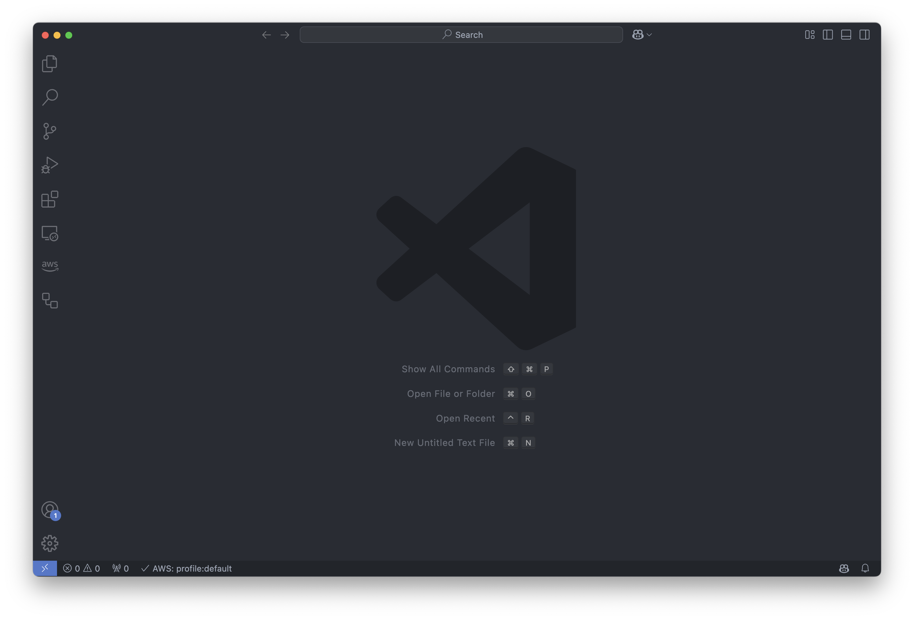
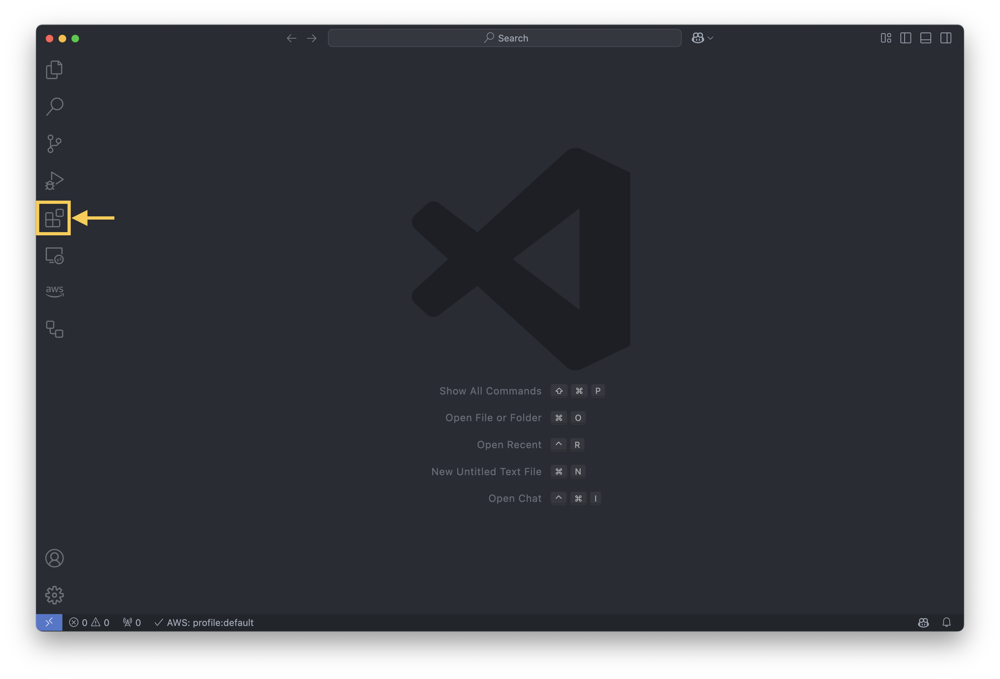

import { Steps } from "@astrojs/starlight/components"
import { Tabs, TabItem } from "@astrojs/starlight/components"
import { Aside } from "@astrojs/starlight/components"
import { Code } from "@astrojs/starlight/components"

<Aside type="note" title="Note">
  Cette section est destinée aux **débutants**. Elle vous guide dans
  l'installation de Python et d'un environnement de développement pour commencer
  à programmer en Python. Si vous possédez déjà Python et un IDE, vous pouvez
  passer directement à la section suivante.
</Aside>

## Installation de Python

Pour commencer à programmer en Python, vous devez installer Python sur votre ordinateur.
Voici comment procéder en fonction de votre système d'exploitation.

<Tabs>
  <TabItem label="Windows"    >
    <Steps>
      <ol>
        <li>
          **Aller sur le site officiel de Python:**  
          Rendez-vous sur https://www.python.org/.
        </li>
        <li>
          **Télécharger Python:**  
          Cliquez sur le bouton "Download" en haut de la page. Le site détecte automatiquement
          votre système d'exploitation et propose la version adaptée (par exemple,
          "Download Python 3.x.x for Windows"). Téléchargez le fichier exécutable
          .exe.
        </li>
        <li>
          **Exécuter le fichier d’installation:**   Double-cliquez sur le
          fichier .exe que vous venez de télécharger.
        </li>
        <li>
          **Activer l'option "Add Python to PATH":**   Sur la première
          fenêtre de l'installation, cochez Add Python 3.x to PATH. Cela
          facilite l'utilisation de Python depuis le terminal ou l'invite de
          commande.
        </li>
        <li>
          **Vérifier l'installation:**  
          Pour vérifier que Python est bien installé, ouvrez un terminal et tapez:
          <Code code={`python --version`} lang="bash" />
          Vous devriez voir s'afficher la version de Python installée.
        </li>
      </ol>
    </Steps  >
  </TabItem>
  <TabItem label="macOS" >
    <Steps>
      <ol>
        <li>
          **Aller sur le site officiel de Python:**   Rendez-vous sur
          https://www.python.org/.
        </li>
        <li>
          **Télécharger Python:**  
          Cliquez sur le bouton "Download" en haut de la page. Le site détecte automatiquement
          votre système d'exploitation et propose la version adaptée (par exemple,
          "Download Python 3.x.x for MacOS"). Téléchargez le fichier exécutable .pkg.
        </li>
        <li>
          **Ouvrir le fichier téléchargé:**  
          Double-cliquez sur le fichier .pkg que vous venez de télécharger.
        </li>
        <li>
          **Suivre les instructions de l’assistant d’installation:**
          <ol>
            <li>Cliquez sur Continue à chaque étape.</li>
            <li>Acceptez les termes et conditions.</li>
            <li>Laissez les options par défaut si vous débutez.</li>
          </ol>
        </li  >
        <li>
          **Vérifier l'installation:**  
          Pour vérifier que Python est bien installé, ouvrez un terminal et tapez:
          <Code code={`python --version`} lang="bash" />
          Vous devriez voir s'afficher la version de Python installée.
        </li>
      </ol>
    </Steps>
  </TabItem>
  <TabItem label="Linux">
      Python est généralement préinstallé sur les distributions Linux. 
      Je vous conseille néanmoins d'installer la version la plus récente de Python 3 afin de bénéficier des dernières fonctionnalités.
      <Steps  >
        <ol>
          <li>
            **Ouvrir un terminal:**   Ouvrez un terminal en appuyant sur
            `Ctrl + Alt + T`.
          </li>
          <li>
            **Installer Python:**   Tapez la commande suivante pour installer
            Python 3:
            <Code
              code={`sudo apt update\nsudo apt install python3`}
              lang="bash"
            />
          </li  >
          <li>
            **Vérifier l'installation:**  
            Pour vérifier que Python est bien installé, ouvrez un nouveau terminal
            et tapez:
            <Code code={`python3 --version`} lang="bash" />
            Vous devriez voir s'afficher la version de Python installée.
          </li>
        </ol>
      </Steps>

    </TabItem>

</Tabs>

<Aside type="tip" title="L'interpréteur Python">
  

    En réalité ce que vous installez est l'**interpréteur Python**, qui est le
    programme qui exécute les instructions que vous écrivez en Python.
  

  

    Un **langage interprété** utilise un programme appelé interpréteur pour
    exécuter le code source ligne par ligne, sans le convertir en un fichier
    exécutable. Cela signifie que vous pouvez exécuter du code Python
    directement sans avoir à le compiler au préalable. Voici quelques exemples
    de langages interprétés: Python, JavaScript, Ruby, PHP.
  

  

    Il est à opposer à un **langage compilé** qui nécessite qu’un programme
    appelé compilateur transforme le code source (écrit par le développeur) en
    un code machine (compréhensible directement par l’ordinateur) avant qu'il
    puisse être exécuté. On retrouve C, C++, Java et Rust parmi les langages
    compilés les plus populaires.
  

</Aside>

## Installation d'un environnement de développement

Un IDE (pour **Integrated Development Environment**, en français environnement de développement intégré) est un logiciel qui fournit aux développeurs une suite d'outils complets pour écrire, tester, déboguer et gérer leur code informatique dans un seul endroit.
L'objectif principal d'un IDE est de rendre le développement de logiciels plus rapide, plus organisé et plus efficace.

Vous pouvez utiliser un simple éditeur de texte pour écrire du code Python, mais un IDE vous offrira de nombreuses fonctionnalités supplémentaires, telles que la coloration syntaxique, l'auto-complétion, le débogage, la gestion de projets, etc.
Au début de votre apprentissage, vous n'utiliserez sans doute pas toutes ces fonctionnalités, mais elles deviendront rapidement indispensables à mesure que vos projets deviendront plus complexes.

Il existe de nombreux IDE, chacun avec ses propres fonctionnalités et avantages.
Voici quelques-uns des IDE les plus populaires:

- **Visual Studio Code**
- **PyCharm**
- **Eclipse**

Si vous avez déjà un IDE préféré, vous pouvez passer cette étape. Sinon, je vous recommande d'installer Visual Studio Code, un IDE gratuit et open-source développé par Microsoft. C'est celui que j'utilise au quotien et que j'utiliserai dans les exemples du site.

### Installation de Visual Studio Code

Visual Studio Code est un IDE léger et puissant qui prend en charge de nombreux langages de programmation, dont Python.

Pour l'installer, suivez les étapes suivantes:

<Tabs>
  <TabItem label="Windows">
    <Steps>
      <ol>
        <li>
          **Aller sur le site officiel de Visual Studio Code:**  
          Rendez-vous sur https://code.visualstudio.com/.
        </li>
        <li>
          **Télécharger Visual Studio Code:**  
          Cliquez sur le bouton "Download" en haut de la page. Le site détecte automatiquement
          votre système d'exploitation et propose la version adaptée (par exemple,
          "Download for Windows"). Téléchargez le fichier exécutable .exe.
        </li>
        <li>
          **Exécuter le fichier d’installation:**   Double-cliquez sur le
          fichier .exe que vous venez de télécharger.
        </li>
        <li>
          **Suivre les instructions de l’assistant d’installation:**  
          Cliquez sur "Next" à chaque étape. Laissez les options par défaut si vous
          débutez.
        </li>
      </ol>
    </Steps>
  </TabItem>
  <TabItem label="macOS">
    <Steps>
      <ol>
        <li>
          **Aller sur le site officiel de Visual Studio Code:**  
          Rendez-vous sur https://code.visualstudio.com/.
        </li>
        <li>
          **Télécharger Visual Studio Code:**  
          Cliquez sur le bouton "Download" en haut de la page. Le site détecte automatiquement
          votre système d'exploitation et propose la version adaptée (par exemple,
          "Download for macOS"). Téléchargez le fichier .dmg.
        </li>
        <li>
          **Ouvrir le fichier téléchargé:**  
          Double-cliquez sur le fichier .dmg que vous venez de télécharger.
        </li>
        <li>
          **Faites glisser l'icône de Visual Studio Code dans le dossier
          Applications:**  
          Faites glisser l'icône de Visual Studio Code dans le dossier Applications
          pour l'installer.
        </li>
      </ol>
    </Steps>
  </TabItem>
  <TabItem label="Linux">
    <Steps>
      <ol>
        <li>
          **Aller sur le site officiel de Visual Studio Code:**  
          Rendez-vous sur https://code.visualstudio.com/.
        </li>
        <li>
          **Télécharger Visual Studio Code:**  
          Cliquez sur le bouton "Download" en haut de la page. Le site détecte automatiquement
          votre système d'exploitation et propose la version adaptée (par exemple,
          "Download for Linux"). Téléchargez le fichier .deb.
        </li>
        <li>
          **Installer Visual Studio Code:**  
          Ouvrez un terminal et tapez la commande suivante pour installer Visual
          Studio Code:
          <Code
            code={`sudo apt update\nsudo apt install ./<nom_du_fichier>.deb`}
            lang="bash"
          />
          Remplacez <code>&lt;nom_du_fichier&gt;</code> par le nom du fichier que
          vous avez téléchargé.
            Par exemple si le fichier s'appelle
          `code_1.61.0-1634175476_amd64.deb`:
          <Code
            code={`sudo apt update\nsudo apt install ./code_1.61.0-1634175476_amd64.deb`}
            lang="bash"
          />
        </li>
      </ol>
    </Steps>
  </TabItem>
</Tabs>

Vous pouvez vérifier que Visual Studio Code est correctement installé en ouvrant l'application. Vous devriez voir une interface similaire à celle-ci:

Happy coding! 🚀

### Installation l'extension Python pour Visual Studio Code

Ce n'est pas obligatoire, mais je vous recommande d'installer l'extension Python pour Visual Studio Code. Elle ajoute de nombreuses fonctionnalités utiles pour programmer en Python, telles que la coloration syntaxique, l'auto-complétion, le débogage, etc.
Voici comment procéder:

<Steps>
  <ol>
    <li>
      **Ouvrir Visual Studio Code:**  
      Ouvrez Visual Studio Code en cliquant sur son icône.
    </li>
    <li>
      **Ouvrir le menu des extensions:**  
      Cliquez sur l'icône des extensions dans la barre latérale gauche ou appuyez
      sur `Ctrl + Shift + X`. 
    </li>
    <li>
      **Rechercher l'extension Python:**  
      Tapez "Python" dans la barre de recherche et appuyez sur `Enter`. 
    </li>
    <li>
      **Installer l'extension Python:**  
      Cliquez sur le bouton "Install" à côté de l'extension Python. 
    </li>
  </ol>
</Steps>

## Liens utiles

- Documentation officielle de vscode: [Visual Studio Code](https://code.visualstudio.com/docs)
